# AI-VOX3 开发板

## 概述

  

AI-VOX3 是一款基于 ESP32-S3-R8 的 AI 语音交互开发板，集成麦克风、功放、SD 卡槽和电源管理，支持本地语音唤醒和指令识别。

**核心特性：**

- 双核 Xtensa LX7 处理器，240MHz 主频
- 16MB Flash + 8MB PSRAM
- Wi-Fi + Bluetooth 5 (LE)
- 板载 ES8311 音频编解码器 + 3W 功放
- 支持 LCD/OLED 显示扩展
- Type-C 供电，支持锂电池充电

**配套扩展：**

- AI-VOX3 扩展板：扩展更多功能接口
- MD40 电机驱动板：驱动多个电机

---

## 产品图

| 正面 | 反面 |
|------|------|
| 

 | 

 |

### 功能标注

  

---

## 硬件说明

### 核心模块

#### 主控芯片

  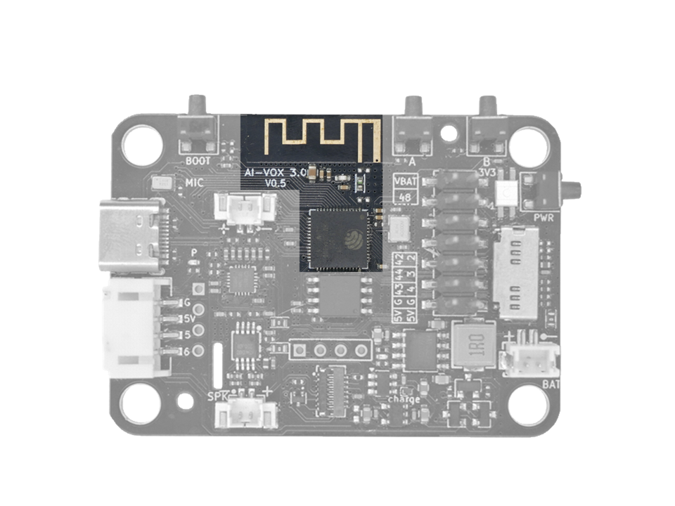

- **型号：** ESP32-S3-R8
- **架构：** Xtensa LX7 双核处理器
- **主频：** 高达 240MHz
- **内置存储：** 512KB SRAM + 384KB ROM
- **无线：** Wi-Fi 802.11 b/g/n + Bluetooth 5 (LE)

#### Flash 存储

  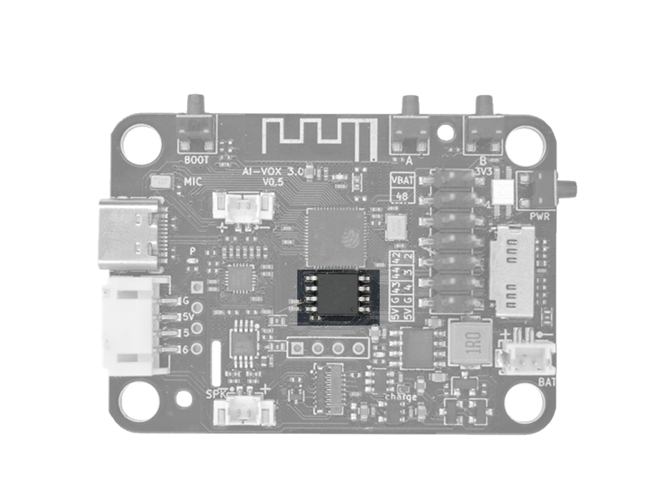

- **容量：** 16MB
- **接口：** SPI
- **用途：** 存储固件和用户数据

#### PSRAM

- **容量：** 8MB（芯片内置）
- **用途：** 大数据量缓存、音频处理、图像缓冲

#### 板载外设引脚

| 外设 | 引脚 | 说明 |
|------|------|------|
| USB D- | IO19 | USB 数据 |
| USB D+ | IO20 | USB 数据 |
| Flash SPI | IO26-IO32 | 内部 Flash |
| 按键 A | IO46 | 用户按键 |
| 按键 B | IO45 | 用户按键 |
| BOOT | IO0 | 启动模式按键 |
| WS2812B | IO41 | RGB LED |
| 电量检测 | IO18 | ADC 输入（电池电压） |

---

### 显示接口

#### LCD 显示屏（SPI）

  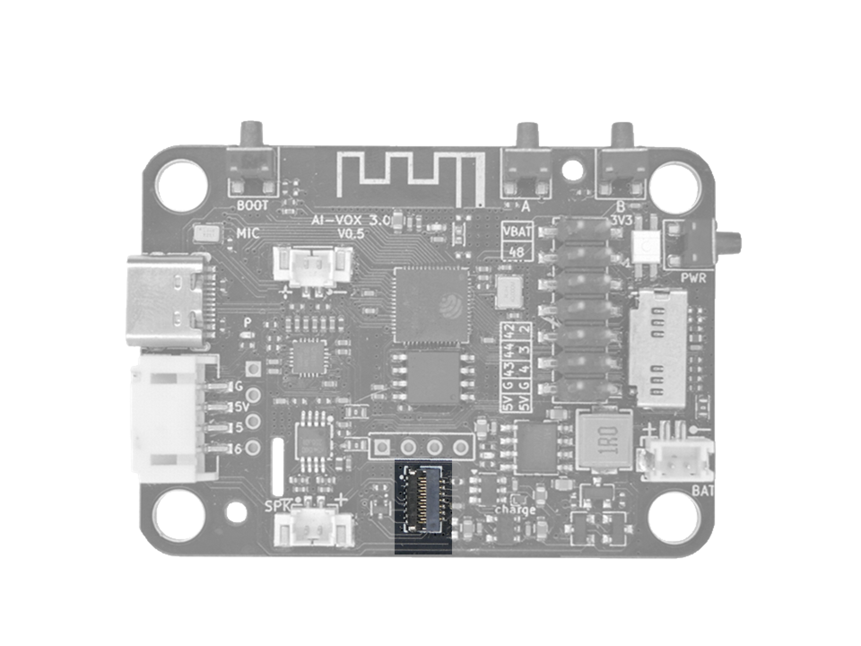

支持 1.54 寸 240×240 SPI LCD（ST7789 驱动），通过 14pin FPC 排线连接。

| 功能 | 引脚 | 说明 |
|------|------|------|
| SDA | IO21 | SPI 数据 |
| SCL | IO17 | SPI 时钟 |
| DC | IO14 | 数据/命令选择 |
| CS | IO15 | 片选 |
| 背光 | IO16 | 背光控制（PWM） |

#### OLED 显示屏（I2C）

  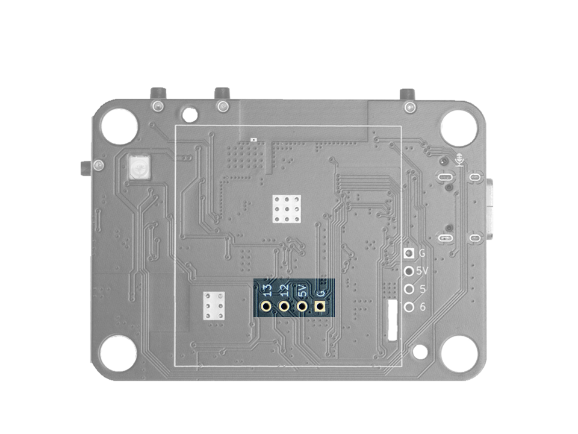

预留 4pin OLED 插口，共用 I2C 总线。

| 功能 | 引脚 | 说明 |
|------|------|------|
| SCL | IO12 | 共用I2C总线 |
| SDA | IO13 | 共用I2C总线 |

**选择建议：**
- LCD：彩色显示，适合图形界面
- OLED：低功耗，适合简单文本/图标
- **注意：** OLED 和 LCD 只能二选一使用

---

### 音频系统

#### 音频编解码器

  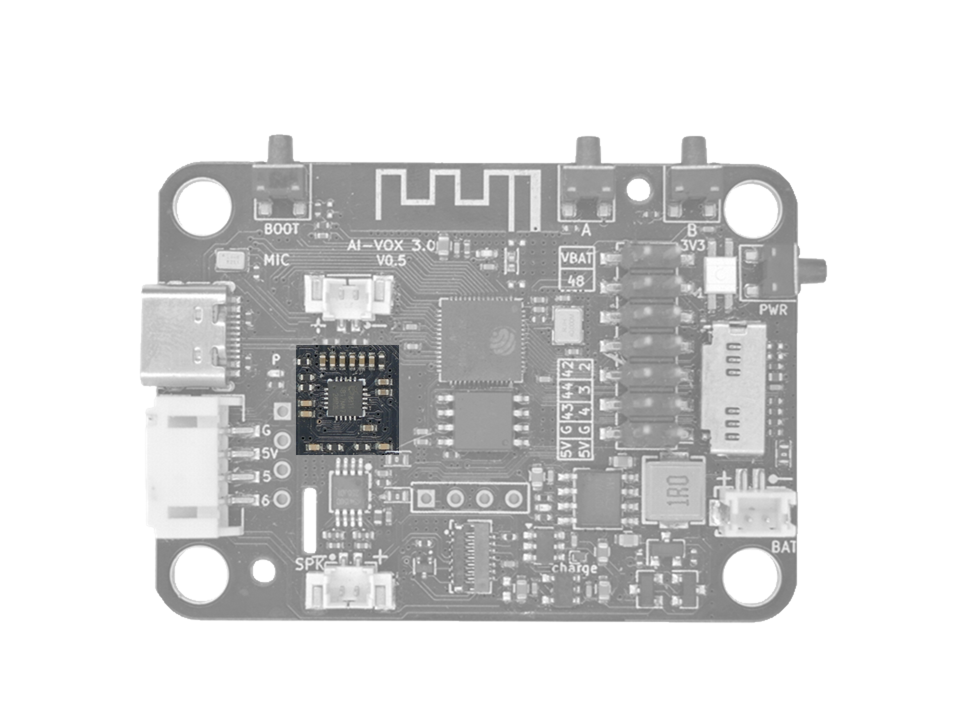

- **型号：** ES8311
- **接口：** I2C（配置）+ I2S（数据传输）
- **功能：** 集成 ADC（模拟麦克风输入）和 DAC（喇叭输出）
- **采样率：** 8kHz ~ 96kHz
- **位深：** 16/24 bit

#### ES8311 引脚定义

| 功能 | 引脚 | 说明 |
|------|------|------|
| I2C SCL | IO12 | I2C 时钟线 |
| I2C SDA | IO13 | I2C 数据线 |
| I2S MCLK | IO11 | 主时钟 |
| I2S SCLK | IO10 | 位时钟 |
| I2S LRCK | IO9 | 左右声道时钟 |
| I2S ASDOUT | IO8 | DAC 输出（到功放） |
| I2S DSDIN | IO7 | ADC 输入（从麦克风） |

#### 功放

  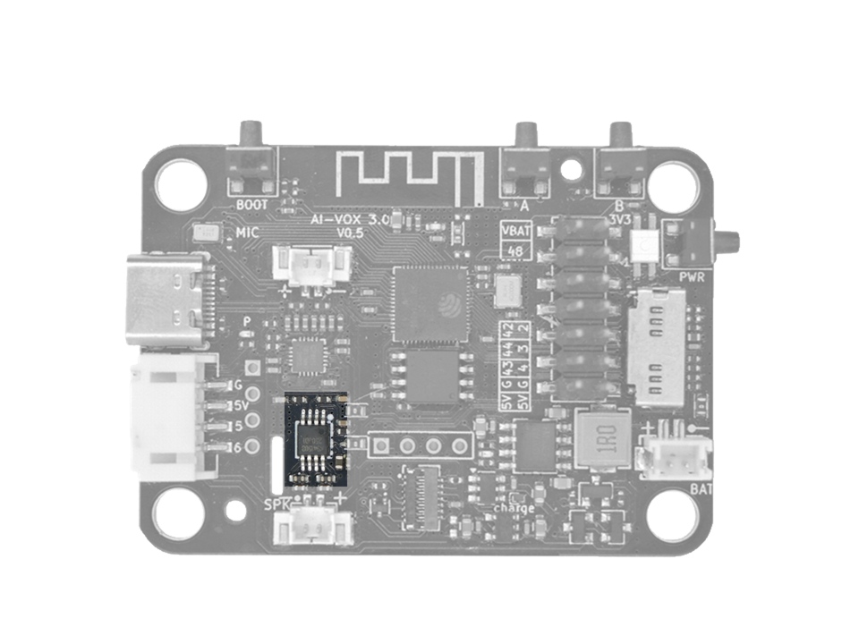

- **型号：** NS4150B
- **输出功率：** 3W（4Ω 负载）
- **输入：** ES8311 PAOUTP/PAOUTN（差分输出）
- **特点：** 低失真、高效率

#### 麦克风

  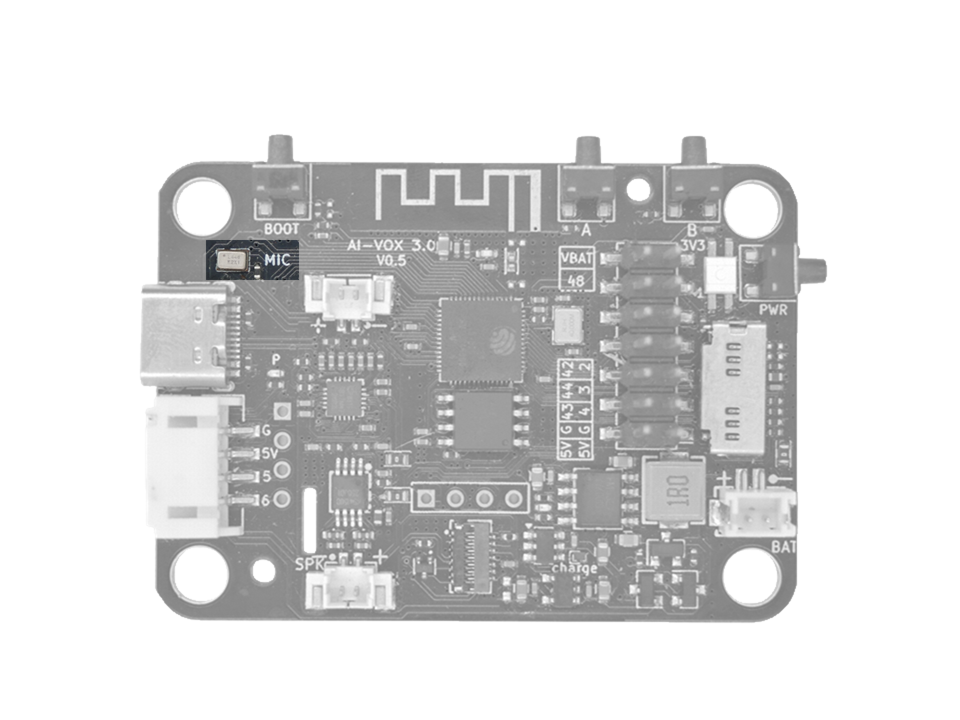

- **板载：** 模拟麦克风
- **外接：** MX1.25 接口（3pin）
- **信号路径：** 麦克风 → ES8311 MIC_IN+/- → ADC → I2S
- **特性：** 支持单麦打断功能

---

### 存储扩展

#### SD 卡接口

  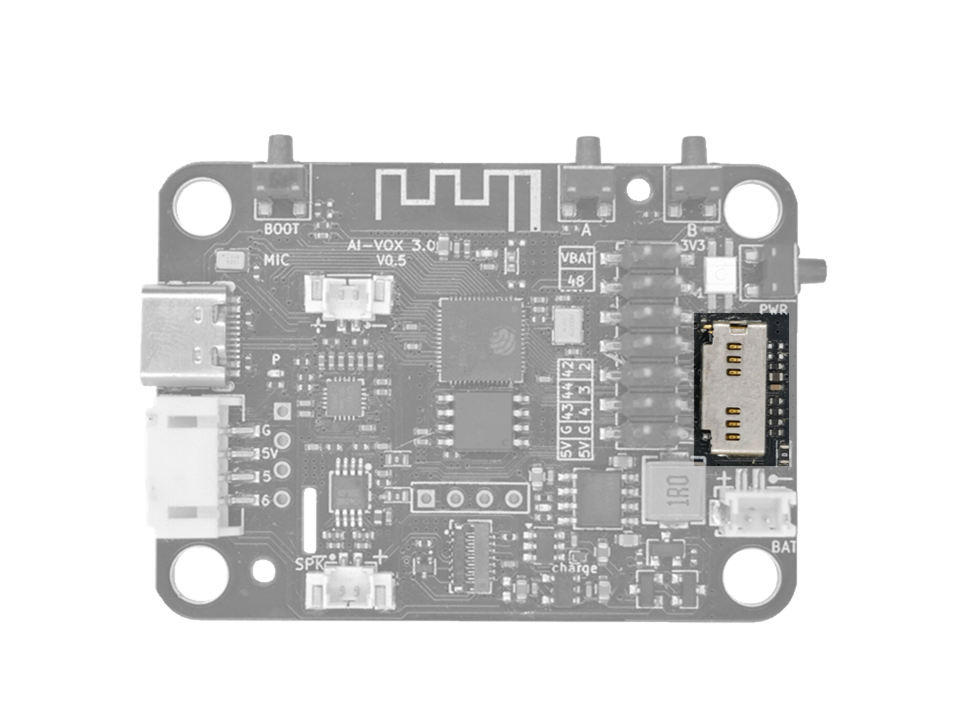

- **卡槽型号：** TF-027-H300
- **支持卡型：** microSD（TF 卡）
- **接口模式：** SD_MMC 1-bit
- **文件系统：** FAT32
- **建议最大容量：** 32GB

#### SD 卡引脚定义

| 功能 | 引脚 | 说明 |
|------|------|------|
| CMD | IO38 | 命令/数据 |
| CLK | IO39 | 时钟 |
| DAT0 | IO40 | 数据 |

**用途：** 存储音频文件、日志数据、配置文件等。

---

### 扩展接口

#### GPIO 排针（8-pin）

  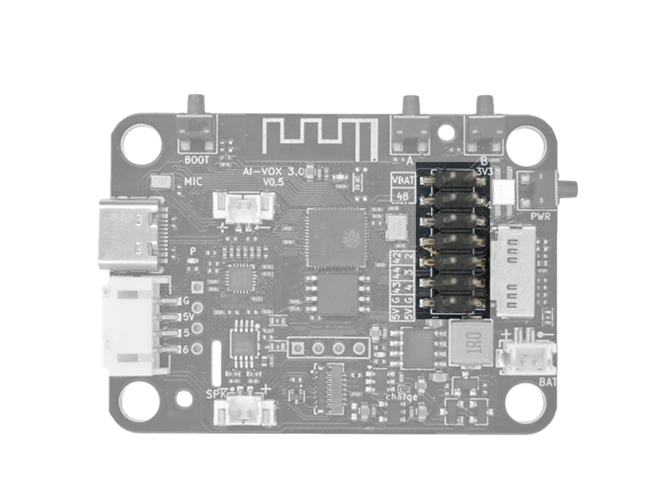

| 引脚 | 功能 | 说明 |
|------|------|------|
| IO1 | GPIO | 通用输入输出 |
| IO2 | GPIO | 通用输入输出 |
| IO3 | GPIO | 通用输入输出 |
| IO4 | GPIO | 通用输入输出 |
| IO42 | GPIO | 通用输入输出 |
| IO43 | GPIO | 通用输入输出 |
| IO44 | GPIO | 通用输入输出 |
| IO48 | GPIO | 通用输入输出 |

**注意：** 所有 GPIO 均支持 PWM、中断、I2C、SPI 等复用功能。

#### PH2.0 接口（4-pin）

  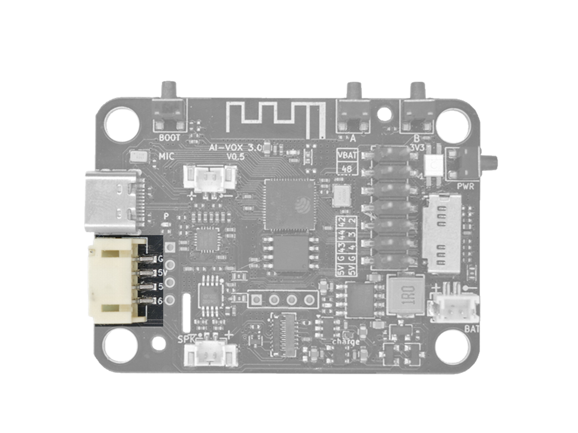

| 引脚 | 功能 | 说明 |
|------|------|------|
| IO5 | GPIO | 通用输入输出 |
| IO6 | GPIO | 通用输入输出 |
| +5V | 电源 | 5V 供电输出/输入 |
| GND | 地 | 公共地 |

**用途：** 可与其他主控板通讯，或作为 5V 电源输出。

#### 配套扩展板

- **AI-VOX3 扩展板：** 通过排针接口扩展更多功能
- **MD40 电机驱动板：** 驱动直流电机、编码电机、舵机

---

## 电源管理

### 供电方式

#### Type-C 接口

  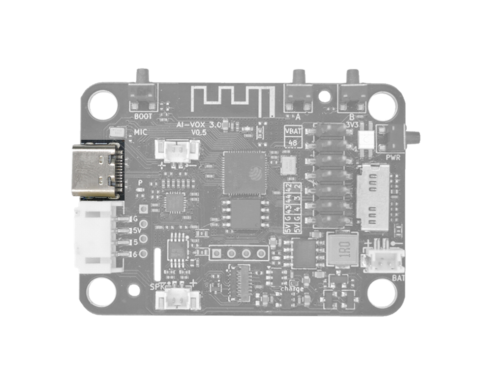

- **电压：** 5V
- **电流：** 最高 1.2A
- **功能：** 供电 + 下载程序 + 锂电池充电

#### 锂电池接口

  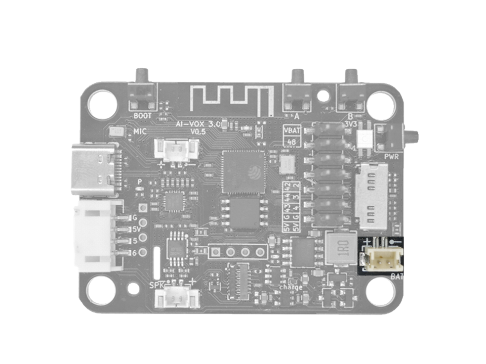

- **电压：** 3.7V ~ 4.2V
- **接口：** ZH1.5-2pin
- **充电管理：** 板载 ETA6093 充电芯片
- **充电效率：** 95%

#### PH2.0-4pin 接口

  

- **电压：** 5V
- **功能：** 供电 + IO5/IO6 通讯

**注意：** 任何供电方式都需要短按 PWR 按键开机。

### 充电参数

- **充电芯片：** ETA6093（充电升压一体）
- **转换效率：** 95%
- **输入：** USB Type-C 5V，最高 1.2A
- **电量检测：** IO18 ADC 实时检测电池电压

---

## 按键

  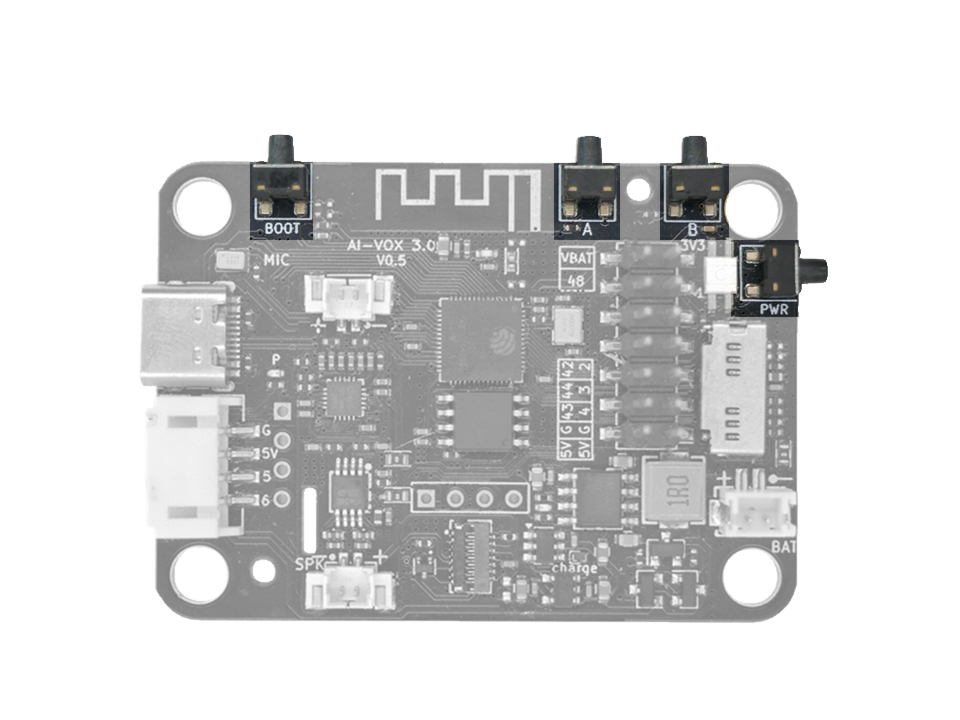

### PWR 按键

| 操作 | 状态 | 功能 |
|------|------|------|
| 短按 | 关机状态 | 开机，红色 PWR 灯亮起 |
| 短按 | 开机状态 | 系统复位 |
| 长按 | 开机状态 | 关机，红色 PWR 灯熄灭 |

### 用户按键

| 按键 | 引脚 | 功能 |
|------|------|------|
| 按键 A | IO46 | 可编程用户按键 |
| 按键 B | IO45 | 可编程用户按键 |

### BOOT 按键

| 按键 | 引脚 | 功能 |
|------|------|------|
| BOOT | IO0 | 启动模式选择（按住 BOOT + 短按 PWR 进入下载模式） |

---

## LED 指示灯

### 电源指示灯

  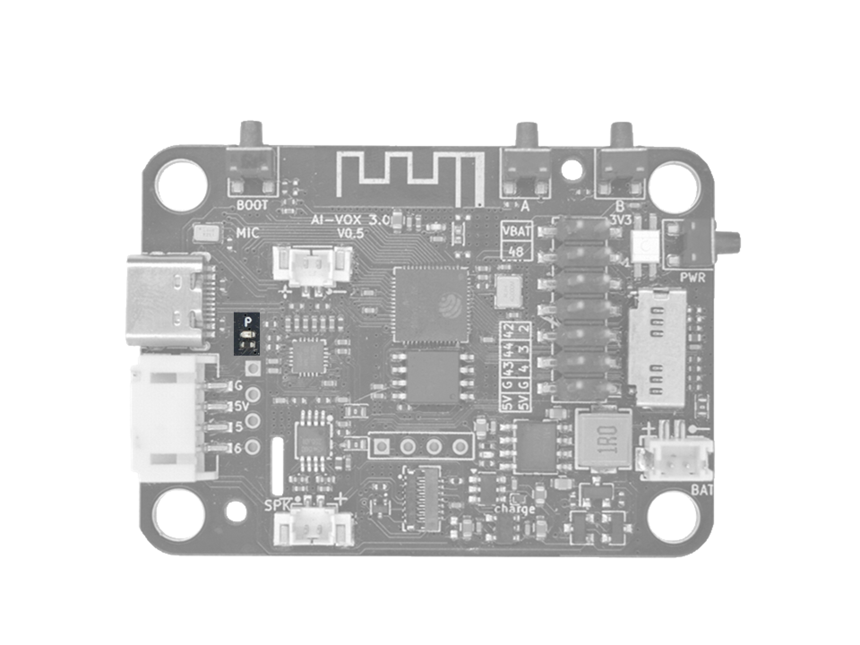

| LED | 颜色 | 状态 | 说明 |
|-----|------|------|------|
| PWR | 红色 | 常亮 | 电源开启 |
| PWR | 红色 | 熄灭 | 电源关闭 |

### 充电指示灯

  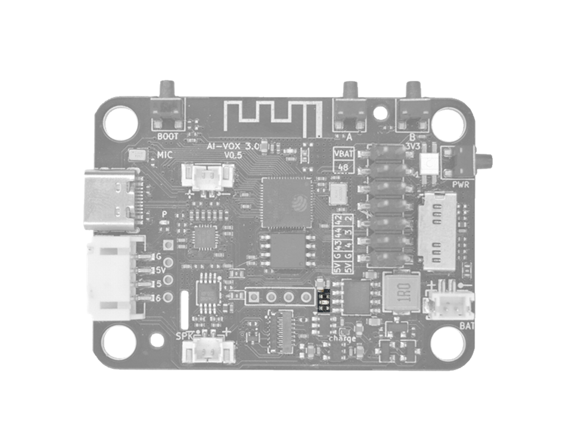

| LED | 颜色 | 状态 | 说明 |
|-----|------|------|------|
| CHARGE | 黄绿色 | 闪烁 | 充电中 |
| CHARGE | 黄绿色 | 常亮 | 电池已充满 |

### RGB LED

  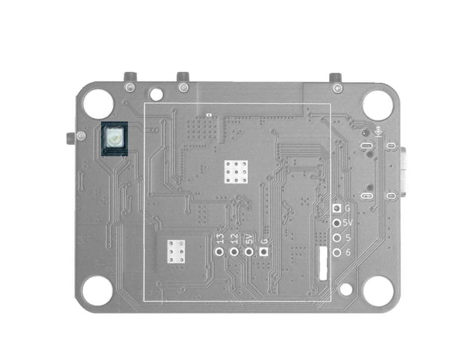

| LED | 引脚 | 说明 |
|-----|------|------|
| WS2812B | IO41 | 可编程 RGB LED，支持 24-bit 真彩色 |

---

## 开发指南

### Arduino IDE

#### 环境配置

参考：[ESP32 系列上传程序方法](../esp32_software_instructions/esp32_software_instructions.md)

**开发板选择：**

  

**推荐配置：**

| 选项 | 值 |
|------|-----|
| Board | ESP32S3 Dev Module |
| Flash Size | 16MB |
| PSRAM | OPI PSRAM |
| Upload Speed | 921600 |
| USB CDC On Boot | Enable |

---

#### 示例程序(基于Arduino)

[下载示例程序 (ZIP)](./ai-vox3_arduino_test_demo.zip)

| 示例 | 依赖库 | 功能 |
|------|--------|------|
| ai_vox3_lcd | [GFX Library for Arduino](https://github.com/moononournation/Arduino_GFX) | LCD 显示屏测试 |
| es8311_test | 无 | 麦克风和功放回环测试 |
| esp8311_sdmmc_test | [ESP32-audioI2S](https://github.com/schreibfaul1/ESP32-audioI2S) | 播放 SD 卡 MP3 |
| ws2812b_test | [Adafruit_NeoPixel](https://github.com/adafruit/Adafruit_NeoPixel) | RGB 灯测试 |
| button_test | [OneButton](https://github.com/mathertel/OneButton) | 按键测试 |

**注意：** 依赖库安装建议直接通过Arduino的库管理器中搜索对应名称进行安装

---

## 故障排除

### 无法开机

**问题：** 按下 PWR 按键后无反应，PWR 灯不亮。

**解决方案：**

1. 检查供电：确认 Type-C 或锂电池已连接
2. 检查电池电压：锂电池电压应 > 3.3V
3. 长按 PWR 按键 3 秒强制开机
4. 尝试更换 Type-C 线缆或充电器

---

### 无法下载程序

**问题：** Arduino IDE 提示 "Failed to connect to ESP32-S3"。

**解决方案：**

1. 按住 BOOT 按键，再短按 PWR 按键进入下载模式
2. 检查 USB 线缆是否支持数据传输（非纯充电线）
3. 安装 [Zadig](https://zadig.akeo.ie/) 驱动（Windows）
4. 降低 Upload Speed 到 115200

---

### 音频无输出

**问题：** 播放音频时喇叭无声。

**解决方案：**

1. 检查喇叭连接：确认喇叭已连接到 PH2.0-2pin 接口
2. 检查音量：确认 ES8311 音量未静音
3. 运行 `es8311_test` 示例验证硬件
4. 检查 I2S 引脚配置：IO7-IO11 是否正确

---

### SD 卡无法识别

**问题：** `SD.begin()` 返回 false。

**解决方案：**

1. 检查 SD 卡格式：必须为 FAT32（不支持 exFAT）
2. 超过 32GB 的卡需要用第三方工具格式化为 FAT32
3. 重新插拔 SD 卡
4. 运行 `esp8311_sdmmc_test` 示例验证

---

### Wi-Fi 连接不稳定

**问题：** Wi-Fi 信号弱或频繁断开。

**解决方案：**

1. 检查天线：确认板载天线未被遮挡
2. 远离干扰源：避开 2.4GHz 设备（微波炉、蓝牙等）
3. 调整 Wi-Fi 信道：使用 1、6、11 信道
4. 降低 Wi-Fi 功率：`WiFi.setTxPower(WIFI_POWER_8_5dBm)`

---

## 资源下载

### 原理图

[下载 AI-VOX3 V1.1 原理图 (PDF)](./docs/AI-VOX3.pdf)

### 芯片数据手册

- [ESP32-S3 数据手册](./docs/esp32-s3_datasheet_cn.pdf)
- [ESP32-S3 技术参考手册](./docs/esp32-s3_technical_reference_manual_cn.pdf)
- [ES8311 音频编解码器](./docs/ES8311.PDF)
- [NS4150B D类功放](./docs/NS4150B.pdf)
- [ETA6093 充电管理芯片](./docs/ETA6093.pdf)
- [ST7789V LCD 驱动芯片](./docs/ST7789V.pdf)
- [WS2812B RGB LED](./docs/WS2812B.pdf)

### 3D 模型

[下载 3D 模型 (ZIP)](./ai-vox3_3d.zip)

### 示例程序

[下载示例程序 (ZIP)](./ai-vox3_arduino_test_demo.zip)

---

## 应用案例

### 小智 AI 语音助手

AI-VOX3 可用于制作小智 AI 语音助手，支持语音对话、音乐播放、智能家居控制等功能。

[查看教程](https://dcnmu33qx4vc.feishu.cn/docx/VXHzdBYH0ohpNAxw2ifc3P2InBe)

### CodexPad-S10 手柄控制

使用 CodexPad-S10 手柄控制直流电机、编码电机、舵机等外设。

[查看详细教程](https://gitee.com/nulllab_1/docs_examples_gamepad_peripheral_control/blob/main/examples_description_ai_vox3_base.zh-CN.md)

---

## 版本历史

| 版本 | 日期 | 修改内容 |
|------|------|---------|
| V1.1 | 2026-06-25 | 当前版本 |

---

