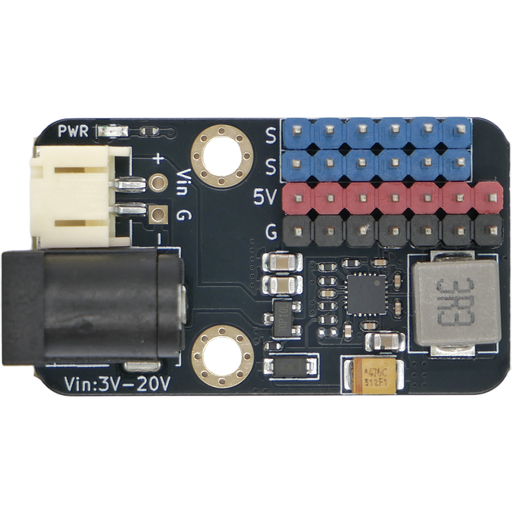
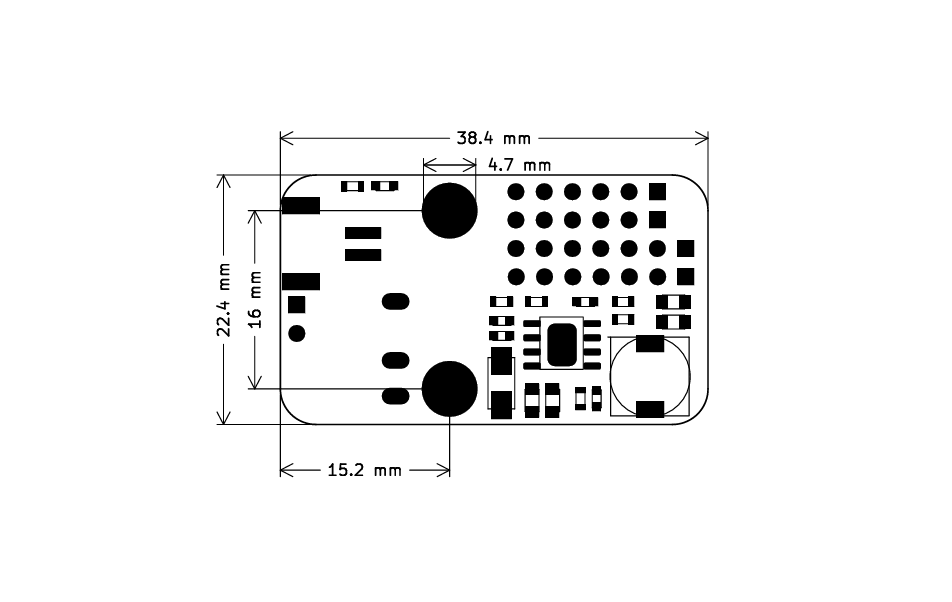

# PM02 5V5A 升降压电源模块

## 实物图

## 概述

该电源模块是一款基于升降压 DC-DC 芯片设计的 5V 5A 输出电源模块。模块支持 PH2.0 接口和 DC 头输入，输入电压范围 3-20V。相比 PM01 纯降压方案，PM02 支持升降压功能，兼容性更强。本模块专为大电流舵机驱动扩展使用，也可以同时给其他需要使用 5V 电压场景供电。

## 模块参数

- 电源输入：PH2.0 接口和 5.5-2.1mm DC 头输入
- 输入电压：3-20V（支持升降压）
- 输出：最大电流 5V 5A，最多可以接 6 路舵机
- 模块尺寸：38.4×22.4 mm
- 安装方式：M4 螺丝（孔径 4.7mm）固定

## 使用说明

- G V S 可以直接接 3pin 直插舵机
- 独立 S 引脚为外部单片机控制信号引脚
- 注意和外部单片机控制使用的时候需要电源模块和主控电源共地连接
- 升降压特性：输入电压低于 5V 时自动升压，高于 5V 时自动降压，始终稳定输出 5V

## 原理图

<a href="./PM02.pdf" target="_blank">点击下载 PM02 原理图</a>

## 机械尺寸图

